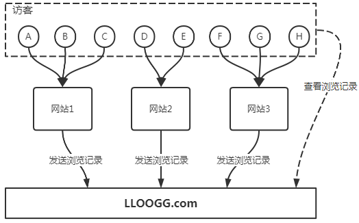
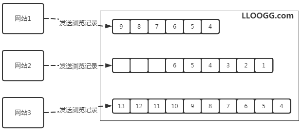

# Redis诞生
参考：[Redis的诞生](https://blog.csdn.net/chengqiuming/article/details/79113358)

## 1、创建者
- 出生于西西里岛的意大利人antirez（笔名）发明的。
- 个人网站：http://invece.org
> 早年是系统管理员，2004到2006年做嵌入式工作，之后接触web，2007年和朋友共同创建一个网站`LLOOGG.com`,并为了解决这个网站的负载问题，而在2009年开发了Redis数据库。

> LOG => LLOOGG

## 2、`LLOOGG.com`
1. LLOOGG.com网站是一个访客信息网站，网站可以通过javascript脚步，将访客IP地址、所属的国家、阅览信息、访问网页地址传送给LLOOGG.com网站。
2. 然后LLOOGG.com会将这些浏览数据通过web页面实时展示给用户，并存储最新的5到10000条浏览记录，以便进行查阅，就是说可以设置查看最近多少条。
3. Google的Analytics直到2011年才有了实时功能，所以说LLOOGG.com实时反馈想法在当时2007年还是很有新意的。

- LLOOGG.com架构图
    - 

- `LLOOGG.com`运作方式：FIFO
    -  
    - 固定长度的队列，`add`/`remove`操作

## 3、负载问题
### 原因
> 当网站越来越多，当网站的用户越来越多，每次MySQL执行推入或弹出操作都需要进行硬盘的读写操作，网站的性能受限于硬盘的I/O操作

### antirez的解决方案
> 这个负载问题根本原因就是硬盘IO，所以antirez在不改变硬件的基础上，通过提升列表的性能来解决负载问题，决定自己写一个具有列表结构的内存数据库原型。最重要的数据存储于内存而不是硬盘，所以程序的性能不会受制于硬盘IO限制，可以以极快的速度执行针对列表的推入和弹出操作。

> 于是antirez使用C语言重写这个内存数据库，并给它加上了持久化功能，这个就是Redis的诞生。

## 4、前后对比
刚开始|现在
:-|:-
只支持列表结构|支持字符串（strings）， 散列（hashes）， 列表（lists）， 集合（sets）， 有序集合（sorted sets） 与范围查询， bitmaps， hyperloglogs 和 地理空间（geospatial） 索引半径查询
单机运行|Redis哨兵（Sentinel）、自动 分区（Cluster）
少量人知晓|广泛使用
antirez无偿开发|Pivotal公司出资开发，GitHub，论坛等

PS：Pivotal公司是一家EMC和Vmware合资的一家公司。