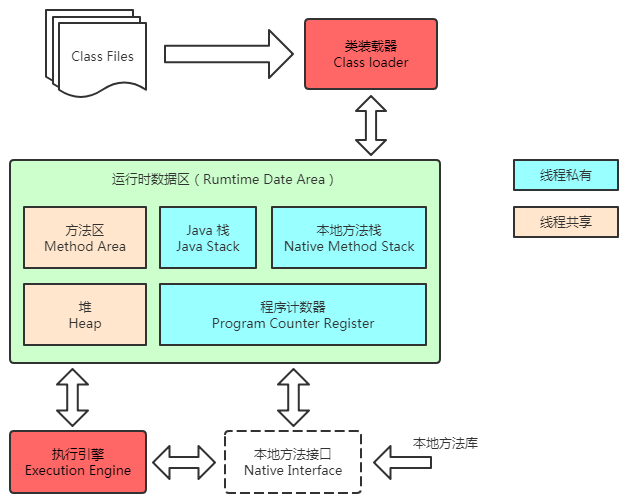

[toc]
## JVM知识点

### 0、JVM内存模型

### 1、类加载器ClassLoader
[ClassLoader](doc/jvm_01_类加载器ClassLoader.md#1classloader体系)、
[双亲委派机制&沙箱机制](doc/jvm_01_类加载器ClassLoader.md#2双亲委派机制沙箱机制)、
[Class.forName & classLoader#loadClass](doc/jvm_01_类加载器ClassLoader.md#4classforname--classloaderloadclass)

### 2、方法区（永久代&元空间）
[方法区（永久代&元空间）](doc/jvm_02_方法区（永久代&元空间）.md)

### 3、常量池
[常量池](doc/jvm_03_常量池.md)
