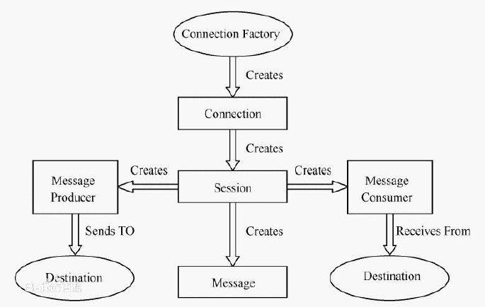

[toc]

## ActiveMQ

### 1、ActiveMQ简介&安装
- [ActiveMQ简介&安装](doc/activemq_01_ActiveMQ简介&安装.md)

### 2、JMS
- [JMS](doc/activemq_02_JMS.md)
- JMS体系架构 

### 3、ActiveMQ简单示例
- [ActiveMQ简单示例](doc/activemq_03_ActiveMQ简单示例.md)

### 4、ActiveMQ事务&消息确认&持久化
- [ActiveMQ事务&消息确认&持久化](doc/activemq_04_ActiveMQ事务&消息确认&持久化.md)

### 5、ActiveMQ消息的同步发送和异步发送
- [ActiveMQ消息的同步发送和异步发送](doc/activemq_05_ActiveMQ消息的同步发送和异步发送.md)

### 6、ActiveMQ消息发送源码分析
- [ActiveMQ消息发送源码分析](doc/activemq_05_ActiveMQ消息发送源码分析.md)