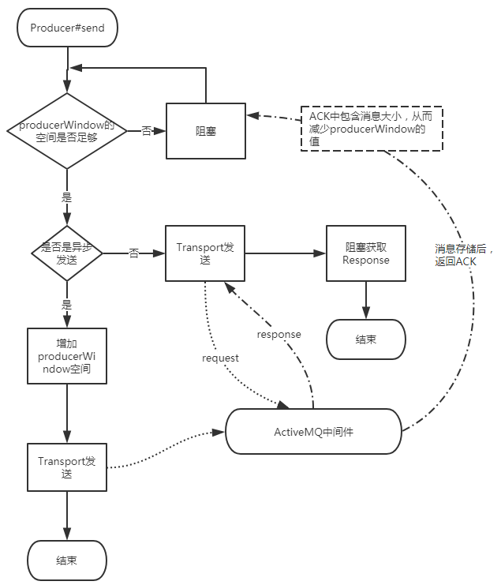

[toc]

# ActiveMQ消息发送源码分析

很有帮助的一篇文章：[ActiveMQ中Producer特性详解](https://shift-alt-ctrl.iteye.com/blog/2034440)

``` java{.line-numbers}
public class QueueProducer {
    public static void main(String[] args) {
        ConnectionFactory connectionFactory = new ActiveMQConnectionFactory("tcp://127.0.0.1:61616");
        Connection connection = null;
        try {
            // 连接
            connection = connectionFactory.createConnection();
            connection.start();
            // 会话
            Session session = connection.createSession(true, Session.AUTO_ACKNOWLEDGE);
            // 目的地
            Destination destination = session.createQueue("xych-test-queue");
            // 消息发送者
            MessageProducer messageProducer = session.createProducer(destination);
            // 创建消息
            TextMessage message = session.createTextMessage("Hello World!");
            // 发送消息
            messageProducer.send(message);
            // 可传入一个AsyncCallback
            // 传入AsyncCallback后，强制同步发送，发送成功后，执行回调方法
            // ((ActiveMQMessageProducer)messageProducer).send(Destination, Message, int, int, long, AsyncCallback)
            session.commit();
            session.close();
            connection.close();
        }
        catch(JMSException e) {
            e.printStackTrace();
        }
    }
}
```
## 1、发送消息流程图


## 2、异步发送
1. ➜ `MessageProducer#send(Message)` <br>
2. ➜ `ActiveMQMessageProducerSupport#send(Message)` <br>
3. ➜ `ActiveMQMessageProducer#send(Destination, Message, int, int, long)` <br>
4. ➜ `ActiveMQMessageProducer#send(Destination, Message, int, int, long, AsyncCallback)` <br>
    ``` java
    // org.apache.activemq.ActiveMQMessageProducer
    public void send(Destination destination, Message message, int deliveryMode, int priority, long timeToLive, AsyncCallback onComplete) throws JMSException {
        
        ...

        if (producerWindow != null) {
            try {
                // 检查producerWindow的空间是否足够
                // 当producer窗口的使用率达到100%时，阻塞
                producerWindow.waitForSpace();
            } catch (InterruptedException e) {
                throw new JMSException("Send aborted due to thread interrupt.");
            }
        }

        this.session.send(this, dest, message, deliveryMode, priority, timeToLive, producerWindow, sendTimeout, onComplete);

        stats.onMessage();
    }
    ```

    ``` java
    // org.apache.activemq.usage.MemoryUsage
    public void waitForSpace() throws InterruptedException {
        if (parent != null) {
            parent.waitForSpace();
        }
        usageLock.readLock().lock();
        try {
            // 当producer窗口的使用率达到100%时，阻塞
            if (percentUsage >= 100 && isStarted()) {
                usageLock.readLock().unlock();
                usageLock.writeLock().lock();
                try {
                    while (percentUsage >= 100 && isStarted()) {
                        // 在org.apache.activemq.usage.MemoryUsage#decreaseUsage(long)
                        // 方法中，会执行waitForSpaceCondition.signalAll()
                        // 从而换线当前线程
                        waitForSpaceCondition.await();
                    }
                } finally {
                    usageLock.writeLock().unlock();
                    usageLock.readLock().lock();
                }
            }

            if (percentUsage >= 100 && !isStarted()) {
                throw new InterruptedException("waitForSpace stopped during wait.");
            }
        } finally {
            usageLock.readLock().unlock();
        }
    }
    ```

5. ➜ `ActiveMQSession#send(ActiveMQMessageProducer, ActiveMQDestination, Message, int, int, long, MemoryUsage, int, AsyncCallback)`
    ``` java
    // org.apache.activemq.ActiveMQSession
    protected void send(ActiveMQMessageProducer producer, ActiveMQDestination destination, Message message, int deliveryMode, int priority, long timeToLive, MemoryUsage producerWindow, int sendTimeout, AsyncCallback onComplete) throws JMSException {
        ...
        synchronized (sendMutex) {
            // 如果是事务模式，开启事务
            doStartTransaction();

            ...
            // 异步发送
            // onComplete没有设置，
            // 且发送超时时间小于0，
            // 且消息不需要反馈，
            // 且连接器不是同步发送模式，
            // 且消息非持久化或者连接器是异步发送模式或者存在事务id的情况下
            if (onComplete==null 
                && sendTimeout <= 0 
                && !msg.isResponseRequired() 
                && !connection.isAlwaysSyncSend() 
                && (!msg.isPersistent() || connection.isUseAsyncSend() || txid != null)) {
                this.connection.asyncSendPacket(msg);
                if (producerWindow != null) {
                    int size = msg.getSize();
                    // 增加producerWindow的空间
                    producerWindow.increaseUsage(size);
                }
            }
            // 同步发送
            else {
                if (sendTimeout > 0 && onComplete==null) {
                    this.connection.syncSendPacket(msg,sendTimeout);
                }else {
                    this.connection.syncSendPacket(msg, onComplete);
                }
            }

        }
    }
    ```
6. ➜ `ActiveMQConnection.asyncSendPacket(Command)`
    ``` java
    // org.apache.activemq.ActiveMQConnection
    public void asyncSendPacket(Command command) throws JMSException {
        if (isClosed()) {
            throw new ConnectionClosedException();
        } else {
            doAsyncSendPacket(command);
        }
    }

    private void doAsyncSendPacket(Command command) throws JMSException {
        try {
            // transport 是一个链式的对象，可以看步骤7:transport的创建
            this.transport.oneway(command);
        } catch (IOException e) {
            throw JMSExceptionSupport.create(e);
        }
    }
    ```
7. `this.transport`的创建（链式）
    > 得到：ResponseCorrelator(MutexTransport(WireFormatNegotiator(InactivityMonitor(TcpTransport))))

    ``` java
    // 指定TCP
    ConnectionFactory connectionFactory = new ActiveMQConnectionFactory("tcp://127.0.0.1:61616");
    Connection connection = connectionFactory.createConnection();
    ```
    1. ➜ `connection = connectionFactory.createConnection()` <br>
    2. ➜ `ActiveMQConnectionFactory#createConnection()` <br>
    3. ➜ `ActiveMQConnectionFactory.createActiveMQConnection(String, String)` <br>
    4. ➜ `ActiveMQConnectionFactory.createTransport()` <br>
    5. ➜ `TransportFactory.connect(URI)` <br>
        ``` java
        public abstract class TransportFactory {
            private static final FactoryFinder TRANSPORT_FACTORY_FINDER = new FactoryFinder("META-INF/services/org/apache/activemq/transport/");

            public static Transport connect(URI location) throws Exception {
                // 这里创建的是 TcpTransportFactory
                TransportFactory tf = findTransportFactory(location);
                // 得到 ResponseCorrelator(MutexTransport(WireFormatNegotiator(InactivityMonitor(TcpTransport))))
                return tf.doConnect(location);
            }

            /**
            * 利用SPI思想，加载META-INF/services/org/apache/activemq/transport/下
            * 指定URI的TransportFactory，这里是 TcpTransportFactory
            */
            public static TransportFactory findTransportFactory(URI location) throws IOException {
                String scheme = location.getScheme();
                if (scheme == null) {
                    throw new IOException("Transport not scheme specified: [" + location + "]");
                }
                TransportFactory tf = TRANSPORT_FACTORYS.get(scheme);
                if (tf == null) {
                    // Try to load if from a META-INF property.
                    try {
                        tf = (TransportFactory)TRANSPORT_FACTORY_FINDER.newInstance(scheme);
                        TRANSPORT_FACTORYS.put(scheme, tf);
                    } catch (Throwable e) {
                        throw IOExceptionSupport.create("Transport scheme NOT recognized: [" + scheme + "]", e);
                    }
                }
                return tf;
            }

            public Transport doConnect(URI location) throws Exception {
                try {
                    Map<String, String> options = new HashMap<String, String>(URISupport.parseParameters(location));
                    if( !options.containsKey("wireFormat.host") ) {
                        options.put("wireFormat.host", location.getHost());
                    }
                    WireFormat wf = createWireFormat(options);
                    // 模板方法，子类 TcpTransportFactory 重写
                    // 返回 TcpTransport
                    Transport transport = createTransport(location, wf);
                    // 对 transport 进行链路包装
                    // 得到 ResponseCorrelator(MutexTransport(WireFormatNegotiator(InactivityMonitor(TcpTransport))))
                    Transport rc = configure(transport, wf, options);
                    //remove auto
                    IntrospectionSupport.extractProperties(options, "auto.");

                    if (!options.isEmpty()) {
                        throw new IllegalArgumentException("Invalid connect parameters: " + options);
                    }
                    return rc;
                } catch (URISyntaxException e) {
                    throw IOExceptionSupport.create(e);
                }
            }

            public Transport configure(Transport transport, WireFormat wf, Map options) throws Exception {
                // 模板方法，子类 TcpTransportFactory 重写
                // 得到 WireFormatNegotiator(InactivityMonitor(TcpTransport))
                transport = compositeConfigure(transport, wf, options);
                
                // 得到 MutexTransport(WireFormatNegotiator(InactivityMonitor(TcpTransport)))
                transport = new MutexTransport(transport);
                // 得到 ResponseCorrelator(MutexTransport(WireFormatNegotiator(InactivityMonitor(TcpTransport))))
                transport = new ResponseCorrelator(transport);

                return transport;
            }
        }
        ```

8. `this.transport.oneway(command)`
    > transport = ResponseCorrelator(MutexTransport(WireFormatNegotiator(InactivityMonitor(TcpTransport)))) <br>
    >- ResponseCorrelator：用于实现异步请求<br>
    >- MutexTransport：实现写锁，表示同一时间只允许发送一个请求<br>
    >- WireFormatNegotiator：实现了客户端连接broker的时候先发送数据解析相关的协议信息，比如解析版本号，是否使用缓存等<br>
    >- InactivityMonitor：用于实现连接成功成功后的心跳检查机制，客户端每10s发送一次心跳信息。服务端每30s读取一次心跳信息。<br>
    >- TcpTransport：JDK Socket连接发送消息<br>


