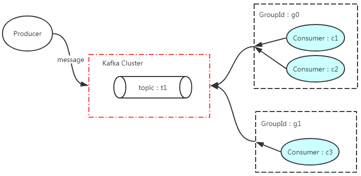

[toc]

# Kafka参数简介

## 1、Producer端参数
### 1.1、`acks`
``` java
// org.apache.kafka.clients.producer.ProducerConfig
public static final String ACKS_CONFIG = "acks";
```
<div style = "font-size:13px;">

取值|备注
:-|:-
`0`|- 消费发送给broker之后，不需要确认。<br>- 性能较高，但会出现消息丢失。
`1`|- 只获取Kafka集群中leader节点的确认即可
`-1`/`all`|- 需要获取ISR中所有的Replica进行确认。<br>- 最安全的，但也有可能消息丢失。
</div>

### 1.2、`batch.size`
``` java
// org.apache.kafka.clients.producer.ProducerConfig
public static final String BATCH_SIZE_CONFIG = "batch.size";
```
> 通过改参数，控制提交消息的时机。<br>

> 生产者发送多个消息到Broker上用一个分区时，为减少网络请求带来的性能开销，生产者会通过批量的方式来提交消息。

> 当未提交的消息总大小达到`batch.size`参数值的时候，触发一次提交。

> 默认大小是`16384`byte,也就是16kb。

> 权衡问题：当消费者宕机时，未提交的消息会丢失。设置较小的值，减少丢失量，但会增加网络请求的开销。

### 1.3、`linger.ms`
``` java
// org.apache.kafka.clients.producer.ProducerConfig
public static final String LINGER_MS_CONFIG = "linger.ms";
```
> 通过改参数，控制提交消息的时机。<br>

> 批处理延迟提交的时间上限。<br>
> 在`linger.ms`参数值的时间间隔内，必定触发一次消息提交。

> 默认值：0，即无延迟。此时`batch.size`无作用。

### 1.4、`max.request.size`
``` java
// org.apache.kafka.clients.producer.ProducerConfig
public static final String MAX_REQUEST_SIZE_CONFIG = "max.request.size";
```
> 批量提交时，消息总大小的上限。

> 避免单词请求，请求内容过大，从而影响吞吐量。

> 默认值：`1048576`，即1M

## 2、Consumer端参数
### 2.1、`group.id`
``` java
// org.apache.kafka.clients.consumer.ConsumerConfig
public static final String GROUP_ID_CONFIG = "group.id";
```
> Consumer Group 是Kafka提供的可扩展且具有容错性的消费机制。



- 如图：
    1. kafka集群中有topic：`t1`，消费者`c1`、`c2`和`c3`，GroupId：`g0`和`g1`
    2. 其中`c1`和`c2`的GroupId都指定为`g0`，`c3`单独指定`g1`，
    3. `g0`和`g1`都是对`t1`进行消费

- 消费结果：
    1. `g0`、`g1`都会去消费t1中的消息，且相互不会影响，即`t1`中的某个消息即会被`g0`消费，也会被`g1`消费。
    2. `c1`、`c2`因指定同一个GroupId，故同时消费`t1`中的消息，至于`c1`、`c2`怎么协调，是另外的事情，暂不讨论
    3. `c3`是`g1`中唯一的消费者，故独自消费`t1`中的消息

- PS：
    1. Kafka中，每个个topic至少有一个分区
    2. 在同一个GroupId下，一个分区只能被一个消费者消费，即当消费者的数量大于某个topic的分区数，必定有消费者是空闲的。
    2. 目的是，每个分区同一时间只会被一个消费者所消费，从而避免了线程同步问题。

### 2.2、`enable.auto.commit`、`auto.commit.interval.ms`
``` java
// org.apache.kafka.clients.consumer.ConsumerConfig
// 是否开启自动提交：默认true
public static final String ENABLE_AUTO_COMMIT_CONFIG = "enable.auto.commit";
// 间隔时间，单位：毫秒，默认5000
public static final String AUTO_COMMIT_INTERVAL_MS_CONFIG = "auto.commit.interval.ms";
```
消费者消费消息后自动提交，只有消息提交后，该消息才不会被再次消费掉。

PS:可以通过`consumer.commitSync()`、`consumer.commitAsync()`的方式显式的确认

### 2.3、`auto.offset.reset`
``` java
// org.apache.kafka.clients.consumer.ConsumerConfig
public static final String AUTO_OFFSET_RESET_CONFIG = "auto.offset.reset";
```
> Kafka集群，每个`Topic`至少有一个`Partition`（分区。PS：每个`Partition`分布在不同的Kafka节点上）。<br>

> `offset` 偏移量 <br>
> 某个`Topic`的`Partition`下，是递增的。

> 当`Producer`端发送消息至Kafka集群时，该消息必定会被分发到某个`Partition`下，同时会获得在该`partition`下的`offset`值。<br>
> Kafka的每个节点会维护offset的值，用来表示`Consumer Group`在当前`Partition`下已经消费了多少消息。记录的维度：`GroupId + GroupId`


<div style = "font-size:13px;">

取值|备注
:-|:-
`earliest`|- 当前Kafka节点中没有维护GroupId的offset，该消费者会从头开始消费改分区下的所有消息。<br>- 有维护的话，以当前分区下最后提交的消息的offset+1的消息开始消费。
`latest`|- 有维护，以当前分区下最后提交的消息的offset+1的消息开始消费。<br>- 未维护，只会消费加入后的新消息。
`none`|如果未维护，则抛出异常。

</div>

- 对于已经存在的Group，都会以已提交消息中最大的offset处开始消费未提交的消息。
- 对于不存在Group，即新加入的Group
    - `earliest`：从头开始消费该`Partition`下的所有消息，不论其他`Consumer Group`是否已经消费过。
    - `latest`：只会消费加入后的新消息。
    - `none`：报错。

### 2.4、`max.poll.records`、`max.poll.interval.ms`
``` java
// org.apache.kafka.clients.consumer.ConsumerConfig
// 每次poll消息时的消息数量：默认500
public static final String MAX_POLL_RECORDS_CONFIG = "max.poll.records";
// 间隔时间，单位：毫秒，默认300000
public static final String MAX_POLL_INTERVAL_MS_CONFIG = "max.poll.interval.ms";
```
> 消费者调用poll时，从kafka集群拉取的消息数量。

> PS：Kafka集群不会主动推送消息至消费者，只会被动的接收消费者的poll命令。


