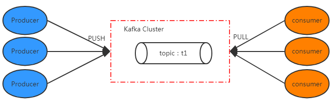
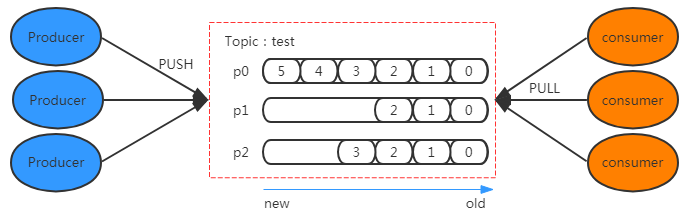
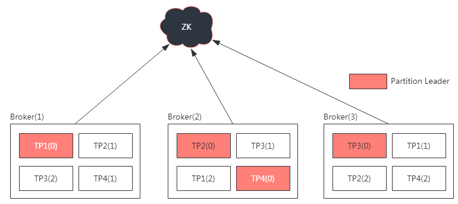

[toc]

# `Topic`、`Partition`、分区副本

## 1、Topic
> 在kafka中，`Topic`是一个存储消息的逻辑概念，可以认为是一个消息集合。每条消息发送到kafka集群的消息都有一个类别。物理上来说，不同的`Topic`的消息是分开存储的。<br>

> 每个`Topic`可以有多个生产者向它发送消息，也可以有多个消费者去消费其中的消息。



## 2、Partition
> `Partition`，分区。<br>

> 每个`Topic`可以划分多个`Partition`（每个Topic至少一个Partition）。

> 在同一个`Topic`下，每个分区的消息是不同的，即`Topic下所有的消息 = Topic下所有Partition中的消息的合集`

> 当Producer发送一个消息到Kafka集群时，会被路由到其中一个分区Partition。

> 当一个消息被路由到某个分区时，都会被分配一个`offset`，它是该消息在该分区中唯一编号。

> `Kafka`通过offset保证消息在某分区内的顺序，但是offset不会跨越分区，即Kafka只能保证在同一个分区的消息是有序的。<br>



- Partition是以文件的形式存到Broker所在机器上的
    - 存储目录：config/server.properties
        ``` properties
        log.dirs=/tmp/kafka-logs
        ```
    - 命名方式：`topic-分区下标`

## 3、分区副本
> 为防止某节点宕机，从而导致该节点上所有的消息丢失，故每个分区可以设置副本，存储到其他节点上。

> <br> <br>
> 如图，该Topic下有4个分区：TP1、TP2、TP3、TP4，每个分区有3个副本，其中一个副本的角色是Leader。

- 每个Topic的`分区数`<b>可以大于</b>`集群的节点数`<br>
- 每个Partition的`副本数`<b>不能大于</b>`集群的节点数`
