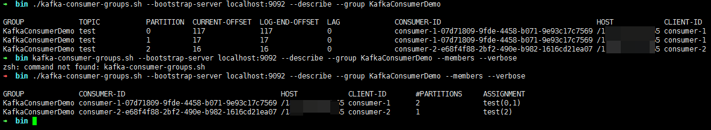

[toc]

# 消息消费_offset

## 1、了解offset


> `offset` 偏移量 <br>
> 某个`Topic`的`Partition`下，是递增的。

> 当`Producer`端发送消息至Kafka集群时，该消息必定会被分发到某个`Partition`下，同时会获得在该`partition`下的`offset`值。<br>
> Kafka的每个节点会维护offset的值，用来表示`Consumer Group`在当前`Partition`下已经消费了多少消息。记录的维度：`GroupId + Topic`

### 1.1、消费者参数：`auto.offset.reset`
``` java
// org.apache.kafka.clients.consumer.ConsumerConfig
public static final String AUTO_OFFSET_RESET_CONFIG = "auto.offset.reset";
```
<div style = "font-size:13px;">

取值|备注
:-|:-
`earliest`|- 当前Kafka节点中没有维护GroupId的offset，该消费者会从头开始消费改分区下的所有消息。<br>- 有维护的话，以当前分区下最后提交的消息的offset+1的消息开始消费。
`latest`|- 有维护，以当前分区下最后提交的消息的offset+1的消息开始消费。<br>- 未维护，只会消费加入后的新消息。
`none`|如果未维护，则抛出异常。

</div>

- 对于已经存在的Group，都会以已提交消息中最大的offset处开始消费未提交的消息。
- 对于不存在Group，即新加入的Group
    - `earliest`：从头开始消费该`Partition`下的所有消息，不论其他`Consumer Group`是否已经消费过。
    - `latest`：只会消费加入后的新消息。
    - `none`：报错。

## 2、Kafka集群记录offset
> 老版本的Kafka，是将Consumer offset存储Zookeeper中，新版本中是存储在kafka本地文件中。

> 在Kafka中，有一个Topic：`__consumer_offsets`，默认50个分区，1个分区副本。

> 该Topic用来记录某个Consumer Group在某个Topic下的某个分区消费的offset值，从而防止消费者重连后重复消费消息的问题。

> 又因为`__consumer_offsets`也是一个Topic，默认请求下，它的50个分区会均匀的分布在Kafka集群的各个节点中。

> 某个ConsumerGroup存储的位置：kafka-logs/__consumer_offsets-*<br>
> 其中 * = Math.abs(groupId.hashCode())%50<br>

## 3、查看offset相关命令
参考：[Apache-检查消费者的位置](http://kafka.apache.org/documentation/#basic_ops_consumer_lag)
- 查看ConsumerGroup在各个分区下的offset值
    ``` shell
    > ./kafka-consumer-groups.sh --bootstrap-server localhost:9092 --describe --group my-group
    ```

- 查看各个消费者对应的分区（分区数量、分区下标）
    ``` shell
    > ./kafka-consumer-groups.sh --bootstrap-server localhost:9092 --describe --group my-group --members --verbose
    ```



