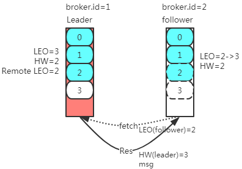
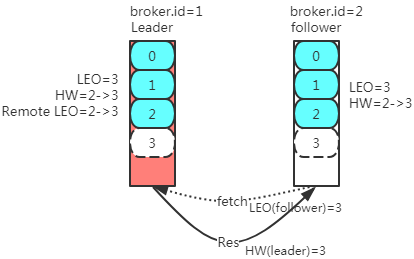

[toc]

# Kafka副本数据丢失&解决方案

# 1、消费端参数`acks`
``` java
// org.apache.kafka.clients.producer.ProducerConfig
public static final String ACKS_CONFIG = "acks";
```
<div style = "font-size:13px;">

取值|备注
:-|:-
`0`|- 消费发送给broker之后，不需要确认。<br>- 性能较高，但会出现消息丢失。
`1`|- 只获取Kafka集群中leader节点的确认即可
`-1`/`all`|- 需要获取ISR中所有的Replica进行确认。<br>- 最安全的，但也有可能消息丢失。
</div>

- 当此参数为`0`、`1`时，会出现消息丢失，这种丢失很好理解，就不细讲了。

- 这里讲解，取值为`-1`/`all`时，为什么也会数据丢失。


# 2、副本数据丢失
> 副本数据同步过程请参考：[Kafka副本数据同步](kafka_12_Kafka副本数据同步.md#22第一种情况)

- LEO、HW、Remote LEO更新：
    - Leader端
        - LEO：新消息进入log日志，加1
        - remote.LEO = follower发起fetch携带的follower.LEO
        - `leader.HW = min(leader.LEO, remote.LEO)`
    - Follower端
        - LEO：新消息进入log日志，加1
        - `follower.HW = min(follower.LEO, leader.HW)`

<div style = "font-size:13px;">

图|讲解
:-:|:-
|<b>步骤1：</b><br>0、初始状态：Leader接收Producer消息，leader.LEO变为3<br>1、follower发起fetch请求，携带follower.LEO=2<br>2、leader接收到请求之后，<br>&nbsp;&nbsp;&nbsp;&nbsp;2.1、`remote.LEO=follower.LEO`=2,<br>&nbsp;&nbsp;&nbsp;&nbsp;2.2、`follower.HW = min(follower.LEO, leader.HW)`=2<br>&nbsp;&nbsp;&nbsp;&nbsp;2.3、响应参数（msg、leader.LEO=3）<br>3、follower接收响应<br>&nbsp;&nbsp;&nbsp;&nbsp;3.1、将消息追加到log文件，更新LEO=3<br>&nbsp;&nbsp;&nbsp;&nbsp;3.2、`follower.HW = min(follower.LEO, leader.HW)`=2
|<b>步骤2：</b><br>follower端再次发起fetch请求<br>1、leader接收到请求之后<br>&nbsp;&nbsp;&nbsp;&nbsp;1.1、`remote.LEO=follower.LEO`=3,<br>&nbsp;&nbsp;&nbsp;&nbsp;1.2、`follower.HW = min(follower.LEO, leader.HW)`=3<br>&nbsp;&nbsp;&nbsp;&nbsp;1.3、响应参数（leader.LEO=3）<br>2、follower接收响应<br>&nbsp;&nbsp;&nbsp;&nbsp;2.1、无消息，不更新LEO<br>&nbsp;&nbsp;&nbsp;&nbsp;2.2、`follower.HW = min(follower.LEO, leader.HW)`=3
</div>

> 上面是正常情况

> 为方便理解，<b>假设</b>ISR集合收缩到只有一个follower副本了，即此时有leader副本和一个follower副本。

> 因为生产者`acks=-1`，所以在步骤2.1.3之后(此时，Leader副本认为所有ISR都已“正确”的保存了2号消息)，需要发给生产这个回执ack，用于告知生产者，集群以保存这条消息。

<b>在步骤2中，follower在发送fetch请求之后，接收到响应之前，宕机了</b>

那么，follower恢复之后，发现HW<LEO，就会丢弃2号消息，并设置LEO=HW，之后重新发起fetch请求，同步Leader分区。

<b>在假设，follower恢复之后，未发起新的fetch请求，Leader节点宕机了，那么此时，broker.id=2作为ISR中唯一的节点，就会成为新的Leader节点</b>

在这种情况下，新的Leader节点的LEO、HW都为2，即只包含了两条消息，2号消息在该几点重启的时候，删除掉了。
但是2号消息的ack已经被前一个Leader节点发给生产者了。

造成的情况：2号消息丢失。生产者认为集群已正确接收，但集群因为副本数据同步延迟、宕机等问题，造成该消息丢失。

# 3、解决方案