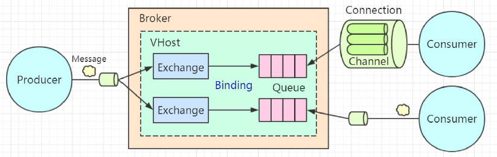

[toc]

# RabbitMQ的工作模型

## 1、Broker
> 服务节点 
> RabbitMQ默认端口号：5672

## 2、Connection
> TCP长连接。 
> 不论生产者还是消费者，都要与Broker建立Connection长连接。

## 3、Channel
> 消息信道。 
> 为了避免频繁的创建、销毁Connection长连接，所在TCP长连接的基础上创建了Channel的概念。 
> 生产者和消费者在Connection长连接里创建销毁Channel，利用Channel来收发消息。
> 在RabbitMQ的JavaAPI中，所有与Broker的操作都是通过Channel完成的。

## 4、Queue
> 队列。 
> 消费者直接连接的对象。 
> 队列，FIFO的特性，只有前一条消息被移除（消息到期、被删除、被消费），下一条消息才能被使用 
> 消费者获取消息的方式：1、PUSH模式：生产者发送消息至Broker，Broker立马推送给消费者。2、PULL模式：消息存放在Broker上，等待消费者主动获取（消费者基于时间机制，实现对队列的监听）。

## 5、Exchange
> 交换机。 
> 作用：分发消息。 
> 首先，Exchange和Queue需要进行绑定（Binding），即绑定关系[交换机名、队列名、routingKey]， 
> 其次，Exchange根据消息的routingKey，来遍自己的绑定关系，从中查询符合条件的队列， 
> 最后，将该消息路由到相关的队列中。

## 6、Vhost
> 虚拟主机 
> 每个Vhost下Exchange、Queue是相互独立的。可以同名 
> 作用：  
> 1、提高对硬件资源的利用。 
> 2、实现对数据的隔离 
> 3、权限的控制
