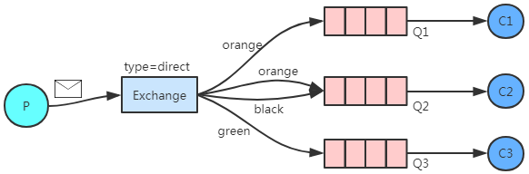
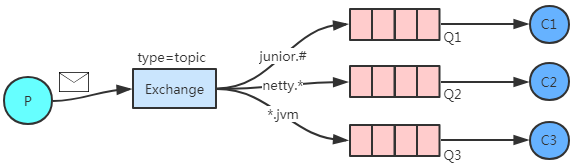
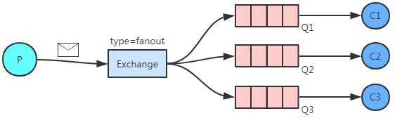
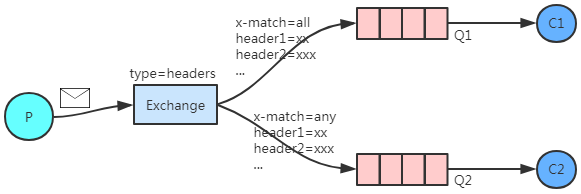

[toc]

# RabbitMQ路由方式（Exchange类型）

## 1、内置的Exchange类型
``` java
// com.rabbitmq.client.BuiltinExchangeType
public enum BuiltinExchangeType {

    DIRECT("direct"),   // 直连
    FANOUT("fanout"),   // 广播、扇形
    TOPIC("topic"),     // 话题
    HEADERS("headers"); // 

    private final String type;

    BuiltinExchangeType(String type) {
        this.type = type;
    }

    public String getType() {
        return type;
    }
}
```

## 2、direct exchange
> Exchange和Queue的绑定需要指定一个精确绑定键。<br>
> 只有当消息携带的routingKey和绑定键完全匹配时，才会路由到对应的Queue上。

参考：[官方文档](https://www.rabbitmq.com/tutorials/amqp-concepts.html#exchange-direct)



当消息的routingKey=orange时，该消息会被Exchange分发至Q1、Q2上。

## 3、topic exchange
> Exchange和Queue的绑定键可以使用通配符。

> 通配符：<br>
> `#` 0个或多个<b>单词</b><br>
> `*` 当且仅当1个<b>单词</b>


参考：[官方文档](https://www.rabbitmq.com/tutorials/amqp-concepts.html#exchange-topic)



第一个队列支持路由键以junior开头的消息路由，后面可以有单词，也可以没有。<br>
第二个队列支持路由键以netty开头，并且后面是一个单词的消息路由。<br>
第三个队列支持路由键以jvm结尾，并且前面是一个单词的消息路由。<br>
例如，当消息的routingKey=netty.jvm时，消息会被分发至Q2、Q3上。

## 4、fanout exchange
> 主题类型的交换机与队列绑定时，不需要指定绑定键。<br>
> 因此生产者发送消息到广播类型的交换机上，也不需要携带路由键。<br>
> 消息达到交换机时，所有与之绑定了的队列，都会收到相同的消息的副本。

参考：[官方文档](https://www.rabbitmq.com/tutorials/amqp-concepts.html#exchange-fanout)



应用场景举例：商户信息的写操作，可以通过该交换机类型通知其他业务系统。

## 5、headers exchange
> 忽略绑定键，使用header属性进行路由。<br>
> 在对Exchange和Queue绑定时，执行headers，其中必须指定`x-match`。<br>

参考：[官方文档](https://www.rabbitmq.com/tutorials/amqp-concepts.html#exchange-headers)

- `x-match = any`
    > 当消息的headers和绑定关系的headers有一个相同，该消息就会被分发至该队列上<br>
- `x-match = all`
    > 消息的header必须和绑定关系的header全部一致（消息的header中不需要有x-match），才会被分发

