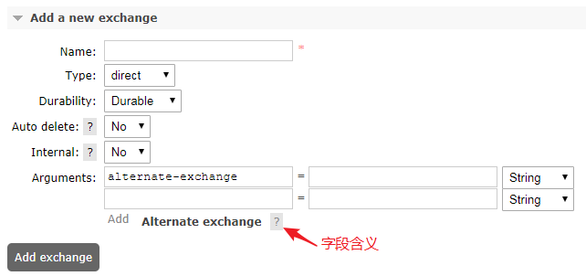
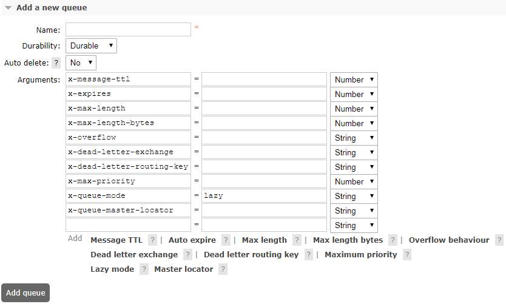
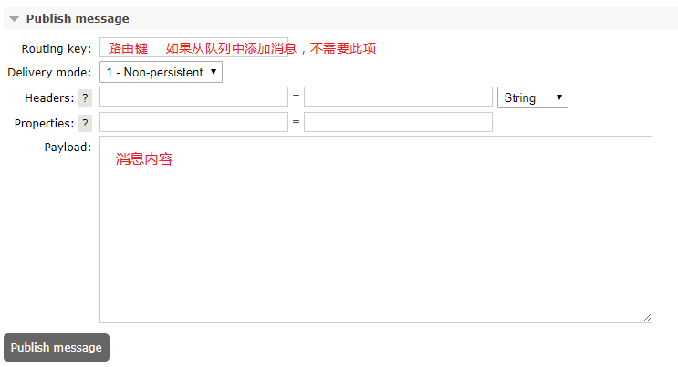

[toc]

# 参数简介

## 1、申明交换机的参数
``` java
// com.rabbitmq.client.Channel
Exchange.DeclareOk exchangeDeclare(String exchange, BuiltinExchangeType type, boolean durable, 
        boolean autoDelete, boolean internal, Map<String, Object> arguments) throws IOException;
```

<b>注意：重复声明，参数一致才不会报错。</b>

<div style = "font-size:13px;">

参数|含义
:-|:-
exchange|交换机名称
type|[交换机类型](rabbitmq_03_RabbitMQ路由方式（Exchange类型）.md)
durable|是否持久化，代表交换机在服务器重启后是否还存在。
autoDelete|是否自动删除。<br>如果是，在第一个Queue或者Exchange与之绑定后，<br>则在所有的Queue、Exchange与之解除绑定后，自动删除自身。
internal|如果是，只能和其他Exchange进行绑定。
arguments|其他参数：<br>- `alternate-exchange`：消息无法直接发送到该Exchange上，只能发送至该参数指定的Exchange上。<br>- 其他自定义参数

</div>

<div style="text-align:center">


</div>

## 2、申明队列的参数
``` java
// com.rabbitmq.client.Channel
Queue.DeclareOk queueDeclare(String queue, boolean durable, boolean exclusive, boolean autoDelete,
                            Map<String, Object> arguments) throws IOException;
```

<b>注意：重复声明，参数一致才不会报错。</b>
<div style = "font-size:13px;">

参数|含义
:-|:-
queue|队列名称
durable|是否持久化
exclusive|是否排他性队列。<br>排他性队列只能在声明它的Connection中使用（可以在同一个Connection的不同的channel中使用），连接断开时自动删除。
autoDelete|是否自动删除。<br>如果是，在第一个消费者与之连接后，当所有的消费者断开连接时，删除自身。
arguments|- `x-message-ttl`：队列中消息的存活时间，单位毫秒<br>- `x-expires`：队列在多久没有消费者访问以后会被删除，单位毫秒<br>- `x-max-length`：队列的最大消息数<br>- `x-max-length-bytes`：队列的最大容量，单位Byte<br>- `x-overflow`：队列溢出行为。<br>&nbsp;&nbsp;&nbsp;&nbsp;&nbsp;&nbsp;&nbsp;&nbsp;&nbsp;&nbsp;&nbsp;&nbsp;&nbsp;&nbsp;&nbsp;&nbsp;&nbsp;&nbsp;&nbsp;&nbsp;&nbsp;&nbsp;&nbsp;&nbsp;&nbsp;这决定了当达到队列的最大长度时，消息会发生什么情况。<br>&nbsp;&nbsp;&nbsp;&nbsp;&nbsp;&nbsp;&nbsp;&nbsp;&nbsp;&nbsp;&nbsp;&nbsp;&nbsp;&nbsp;&nbsp;&nbsp;&nbsp;&nbsp;&nbsp;&nbsp;&nbsp;&nbsp;&nbsp;&nbsp;&nbsp;有效值是`drop head`或`reject publish`<br>- `x-dead-letter-exchange`：队列的死信交换机<br>- `x-dead-letter-routing-key`：死信交换机的路由键<br>- `x-max-priority`：队列中消息的最大优先级，消息的优先级不能超过它<br>- `x-queue-mode`：将队列设置为惰性模式，将尽可能多的消息保留在磁盘上以减少RAM使用；<br>&nbsp;&nbsp;&nbsp;&nbsp;&nbsp;&nbsp;&nbsp;&nbsp;&nbsp;&nbsp;&nbsp;&nbsp;&nbsp;&nbsp;&nbsp;&nbsp;&nbsp;&nbsp;&nbsp;&nbsp;&nbsp;&nbsp;&nbsp;&nbsp;&nbsp;&nbsp;&nbsp;&nbsp;如果未设置，队列将保留内存缓存以尽可能快地传递消息。<br>&nbsp;&nbsp;&nbsp;&nbsp;&nbsp;&nbsp;&nbsp;&nbsp;&nbsp;&nbsp;&nbsp;&nbsp;&nbsp;&nbsp;&nbsp;&nbsp;&nbsp;&nbsp;&nbsp;&nbsp;&nbsp;&nbsp;&nbsp;&nbsp;&nbsp;&nbsp;&nbsp;&nbsp;取值：`lazy`<br>- `x-queue-master-locator`：<br>- 其他自定义参数
</div>
<div style="text-align:center">


</div>

## 3、绑定时的参数
``` java
// com.rabbitmq.client.Channel
Queue.BindOk queueBind(String queue, String exchange, String routingKey) throws IOException;
Queue.BindOk queueBind(String queue, String exchange, String routingKey, Map<String, Object> arguments) throws IOException;
```
<b>注意：重复绑定时，参数不一致会增加一条新的绑定规则。</b>

<div style = "font-size:13px;">

参数|含义
:-|:-
queue|队列名称
exchange|交换机名称
routingKey|路由键
arguments|- `x-match`：参考[交换机类型：headers](rabbitmq_03_RabbitMQ路由方式（Exchange类型）.md#5headers-exchange)<br>- 其他自定义参数

</div>

## 4、消息属性
``` java
AMQP.BasicProperties properties = new AMQP.BasicProperties.Builder()
        .deliveryMode(2) // 持久化消息
        .contentEncoding("UTF-8")
        .expiration("10000") // TTL
        .build();

// com.rabbitmq.client.Channel
void basicPublish(String exchange, String routingKey, BasicProperties props, byte[] body) throws IOException;
```
<div style = "font-size:13px;">

参数|含义
:-|:-
exchange|交换机名称
routingKey|路由键
props|消息属性
body|消息内容
</div>

- 消息属性（com.rabbitmq.client.AMQP.BasicProperties）

<div style = "font-size:13px;">

参数|JavaAPI参数|Java类型|含义
:-|:-|:-|:-
<b>Delivery mode</b>|deliveryMode|Integer|2持久化；其他:瞬态
Headers|headers|Map<String,Object>|消息的其他自定义参数<br>参考[交换机类型：headers](rabbitmq_03_RabbitMQ路由方式（Exchange类型）.md#5headers-exchange)
content_type|contentType|String|消息类型
content_encoding|contentEncoding|String|消费编码格式
<b>priority</b>|priority|Integer|消息的优先级
<b>correlation_id</b>|correlationId|String|关联ID，方便RPC 相应与请求关联
reply_to|replyTo|String|回调队列
<b>expiration</b>|expiration|String|TTL，消息过期时间，单位毫秒
message_id|messageId|String|消息Id
timestamp|timestamp|Date|时间戳
type|type|String|类型
user_id|userId|String|用户Id
app_id|appId|String|应用程序Id
cluster_id|clusterId|String|集群Id

</div>


