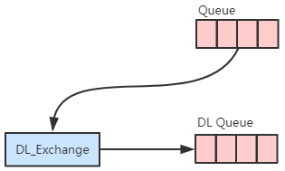

[toc]

# 死信队列

## 1、死信消息
> 死信，Dead Letter，死亡的消息
- 什么情况下，消息会变成死信？
1. 消息过期
2. 在队列指定[x-overflow](rabbitmq_05_参数简介.md#2申明队列的参数)的值为`drop-head`时，且队列已满，则先入队的消息会变成死信消息
3. 消息被消费者拒绝并且未设置重回队列

## 2、死信消息的去处 - 死信交换机
> 当一个队列在声明时，指定了死信交换机和死信路由键，那么该队列的死信消息会被发往指定的交换机，并经过死信路由键路由到响应队列中。


## 3、简单示例
- BaseRabbitMQ
    ``` java
    public abstract class BaseRabbitMQ {
        protected static final String QUEUE_NAME = "len_queue";
        protected static final String DL_EXCHANGE = "DL_EXCHANGE";
        protected static final String DL_ROUTING_KEY = "dl_routing_key";
        protected static final String DL_QUEUE_NAME = "dl_queue";
        protected Connection conn;
        protected Channel channel;

        protected abstract void doRun();

        public void run() {
            try {
                create();
                init();
                doRun();
            }
            catch(IOException | TimeoutException e) {
                e.printStackTrace();
            }
            finally {
                try {
                    channel.close();
                    conn.close();
                }
                catch(IOException | TimeoutException e) {
                    e.printStackTrace();
                }
            }
        }

        private void init() throws IOException {
            // 声明死信交换机
            channel.exchangeDeclare(DL_EXCHANGE, BuiltinExchangeType.DIRECT);
            // 声明死信队列
            channel.queueDeclare(DL_QUEUE_NAME, false, false, false, null);
            // 死信交换机和死信队列的绑定关系
            channel.queueBind(DL_QUEUE_NAME, DL_EXCHANGE, DL_ROUTING_KEY);
            
            // 以上是准备一个死信队列
            // 以下是声明一个有死信队列的正常队列
                
            // 通过队列属性设置消息过期时间
            Map<String, Object> argss = new HashMap<String, Object>();
            // 队列的最大消息数
            argss.put("x-max-length", 5);
            // 队列溢出行为 drop-head:死信;reject-publish:拒绝新消息
            argss.put("x-overflow", "drop-head");
            // argss.put("x-overflow", "reject-publish");
            // 指定死信的交换机
            argss.put("x-dead-letter-exchange", DL_EXCHANGE);
            // 指定死信的路由键
            argss.put("x-dead-letter-routing-key", DL_ROUTING_KEY);
            // 声明队列（默认交换机AMQP default，Direct）
            channel.queueDeclare(QUEUE_NAME, false, false, false, argss);
        }

        private void create() throws IOException, TimeoutException {
            ConnectionFactory factory = new ConnectionFactory();
            // 服务器host
            factory.setHost("xych.online");
            // 端口号
            factory.setPort(5672);
            // 虚拟主机
            factory.setVirtualHost("/");
            // 用户&密码
            // PS：默认的guest/guest不允许远程访问RabbitMQ
            factory.setUsername("admin");
            factory.setPassword("admin");
            // 创建连接
            conn = factory.newConnection();
            // 创建消息通道
            channel = conn.createChannel();
        }
    }
    ```

- DlxProducer
    ``` java
    public class DlxProducer extends BaseRabbitMQ {
        public static void main(String[] args) throws Exception {
            new DlxProducer().run();
            Thread.sleep(1000);
        }
        
        @Override
        protected void doRun() {
            try {
                String msgTemp = "This is TTL msg!";
                // 对每条消息设置过期时间
                AMQP.BasicProperties properties = new AMQP.BasicProperties.Builder()//
                        .deliveryMode(2) // 持久化消息
                        .contentEncoding("UTF-8") //
                        .expiration("20000") // TTL
                        .build();
                // 发送消息
                // 默认交换机，routingKey填写队列名称
                for(int i = 0; i < 10; i++) {
                    String msg = msgTemp + i;
                    System.out.println(msg);
                    channel.basicPublish("", QUEUE_NAME, properties, msg.getBytes());
                }
            }
            catch(IOException e) {
                e.printStackTrace();
            }
        }
    }
    ```
- 运行结果（该示例没有消费者）
    1. 因为队列长度为5，前5条消息会被挤掉，变成死信消息，从而经过该队列的死信交换机发送到另一队里中。
    2. 后5条消息，因为设置了TTL，所以最后也被发往另一队列中。
- 示例图
<div style="text-align:center">


</div>
