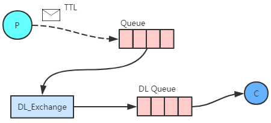
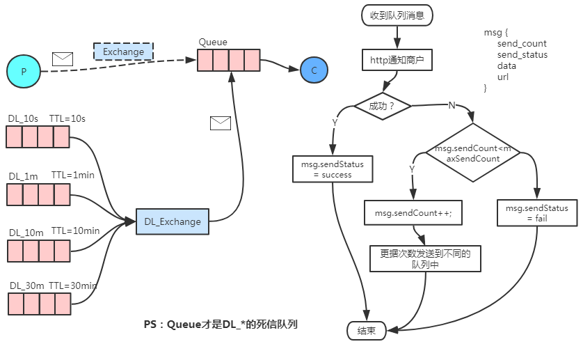

[toc]

# 1、延迟队列
- 场景描述：
    1. 智能家居，热水器15分钟后开始工作
    2. 未付款的订单，15分钟后自动关闭
    3. 支付结果通知商户，通知失败后梯度通知

- 实现方式
    1. 数据库存储，定时器扫描
    2. RabbitMQ，消息TTL + 死信队列
    3. rabbitmq-delayed-message-exchange 插件
    4. 其他


## 2、死信队列方式实现
> 智能家居，热水器15分钟后开始工作<br>
> 未付款的订单，15分钟后自动关闭<br>
> 

> 支付结果通知商户，通知失败后梯度通知：<br>
> 

缺点：
对于梯度延迟队列时，梯度越多，绑定关系越多。


## 3、rabbitmq-delayed-message-exchange 插件

> 目前只支持：Linux

[官方插件](https://www.rabbitmq.com/community-plugins.html)
、
[3.7.x](https://dl.bintray.com/rabbitmq/community-plugins/3.7.x/rabbitmq_delayed_message_exchange/rabbitmq_delayed_message_exchange-20171201-3.7.x.zip)

``` shell
cd rabbitmq_server-3.7.17/plugins
wget https://dl.bintray.com/rabbitmq/community-plugins/3.7.x/rabbitmq_delayed_message_exchange/rabbitmq_delayed_message_exchange-20171201-3.7.x.zip

# 解压
unzip rabbitmq_delayed_message_exchange-20171201-3.7.x.zip
# 重命名
mv rabbitmq_delayed_message_exchange-20171201-3.7.x.ez rabbitmq_delayed_message_exchange-3.7.x.ez

cd ../sbin
# 启用插件
./rabbitmq-plugins enable rabbitmq_delayed_message_exchange
# 停止服务
./rabbitmqctl stop
# 启动服务
./rabbitmq-server -detached
```

### 3.1、交换机类型`x-delayed-message`
``` java
Map<String, Object> argss = new HashMap<String, Object>();
// 源交换机类型（也可以认为路由键的路由方式）
argss.put("x-delayed-type", "direct");

// 交换机类型：x-delayed-message
channel.exchangeDeclare(EXCHANGE_NAME, "x-delayed-message", false, false, argss);
```
### 3.2、发送消息的消息属性的`消息头`增加`x-delay`
``` java
// 延迟的间隔时间，目标时刻减去当前时刻
Map<String, Object> headers = new HashMap<String, Object>();
headers.put("x-delay", delayTime.getTime() - now.getTime());

AMQP.BasicProperties props = new AMQP.BasicProperties.Builder()
        .headers(headers).build();
        
channel.basicPublish(EXCHANGE_NAME, ROUTING_KEY, props, msg.getBytes());
```