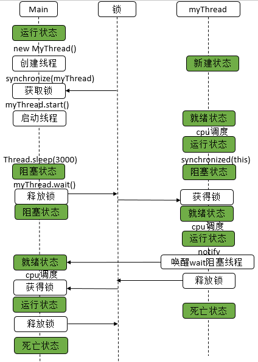

[toc]
## 1、Wait、Notify
### 1.1、WaitAndNotifyDemo
参考 [使用wait/notify实现线程同步](https://www.pdai.tech/md/java/thread/java-thread-x-lock-LockSupport.html#%E4%BD%BF%E7%94%A8wait-notify%E5%AE%9E%E7%8E%B0%E7%BA%BF%E7%A8%8B%E5%90%8C%E6%AD%A5)
``` java
public class WaitAndNotifyDemo {
    public static void main(String[] args) throws InterruptedException {
        Thread myThread = new Thread() {
            @Override
            public void run() {
                synchronized(this) {
                    try {
                        System.out.println("before notify");
                        notify();
                        Thread.sleep(1000);
                        System.out.println("after notify");
                    }
                    catch(InterruptedException e) {
                        e.printStackTrace();
                    }
                }
            }
        };
        synchronized(myThread) {
            try {
                myThread.start();
                Thread.sleep(1000);
                System.out.println("before wait");
                myThread.wait();
                System.out.println("after wait");
            }
            catch(InterruptedException e) {
                e.printStackTrace();
            }
        }
    }
}
```
- 运行结果
    ```
    before wait
    before notify
    after notify
    after wait
    ```
- 分析
    
    


### 1.2、WaitAndNotifyDemo2
``` java
public class WaitAndNotifyDemo2 {
    public static void main(String[] args) throws InterruptedException {
        Thread myThread = new Thread() {
            @Override
            public void run() {
                synchronized(this) {
                    try {
                        System.out.println("before thread notify");
                        notify();
                        System.out.println("after thread notify");
                        Thread.sleep(1000);
                        System.out.println("before thread wait");
                        this.wait();
                        System.out.println("after thread wait");
                        Thread.sleep(1000);
                    }
                    catch(InterruptedException e) {
                        e.printStackTrace();
                    }
                }
            }
        };
        synchronized(myThread) {
            try {
                myThread.start();
                Thread.sleep(1000);
                System.out.println("before main wait");
                myThread.wait();
                System.out.println("after main wait");
                Thread.sleep(1000);
                System.out.println("before main notify");
                myThread.notify();
                System.out.println("after main notify");
                Thread.sleep(1000);
            }
            catch(InterruptedException e) {
                e.printStackTrace();
            }
        }
    }
}
```
- 运行结果
    ```
    before main wait
    before thread notify
    after thread notify
    before thread wait
    after main wait
    before main notify
    after main notify
    after thread wait
    ```