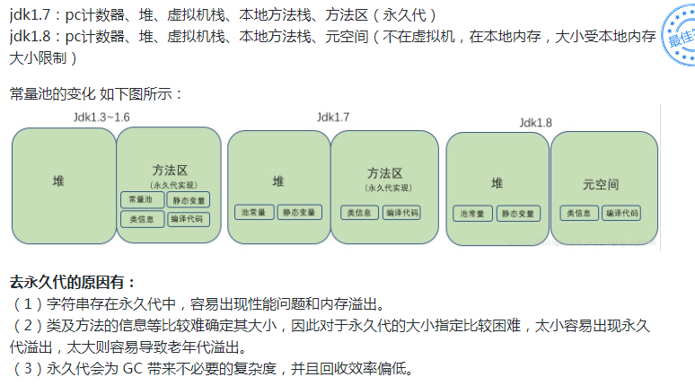

[toc]

### 八种基础数据类型的大小，以及他们的封装类
<div style = "font-size:13px">

基本类型|大小|最大值|最小值|默认值|封装类
:-|:-|:-|:-|:-|:-
byte|8bit|`-2^7`=`-128`|`2^7-1`=`127`|0|Byte
short|16bit|`-2^15`=`-32768`|`2^15-1`=`32767`|0|Short
int|32bit|`-2^31`=`-2178783648`|`2^31-1`=`2147483647`|0|Integer
long|64bit|`-2^63`=`-9,223,372,036,854,775,808`|`2^63 -1`=`9,223,372,036,854,775,807`|0L|Long
float|32bit|`1.4E-45`|`3.4028235E38`|0.0f|Float
double|64bit|`4.9E-324`|`1.7976931348623157E308`|0.0d|Double
char|16bit|\u0000（即0）|\uffff（即65,535）|-|Character
boolean|-|-|-|false|Boolean

</div>

### 引用数据类型
### switch是否能用String做参数
> 能。JDK1.7时，支持String作为switch的的参数；<br>
> 实现原理：利用hash+equals（如下注释内容）<br>
> 目前支持：char、byte、short、int、Character、Byte、Short、Integer、String
- 源码：基于1.8.0_201
    ``` java
    public class App {
        public static synchronized void main(String[] args) throws Exception {
            String str = "";
            switch(str) {
                case "AA":
                    System.out.println("AAAAA");
                    break;
                case "BB":
                    System.out.println("BBBBBB");
                    break;
                default:
                    System.out.println("CCCCC");
                    break;
            }
        }
    }
    ```
- 编译：javap -l -p -c App.class
    ```
    public static synchronized void main(java.lang.String[]) throws java.lang.Exception;
    Code:
        0: ldc           #19                 // String
        2: astore_1
        3: aload_1
        4: dup
        5: astore_2
        6: invokevirtual #21                 // Method java/lang/String.hashCode:()I
        9: lookupswitch  { // 2
                    2080: 36
                    2112: 48
                default: 82
            }
        36: aload_2
        37: ldc           #27                 // String AA
        39: invokevirtual #29                 // Method java/lang/String.equals:(Ljava/lang/Object;)Z
        42: ifne          60
        45: goto          82
        48: aload_2
        49: ldc           #33                 // String BB
        51: invokevirtual #29                 // Method java/lang/String.equals:(Ljava/lang/Object;)Z
        54: ifne          71
        57: goto          82
        60: getstatic     #35                 // Field java/lang/System.out:Ljava/io/PrintStream;
        63: ldc           #41                 // String AAAAA
        65: invokevirtual #43                 // Method java/io/PrintStream.println:(Ljava/lang/String;)V
        68: goto          90
        71: getstatic     #35                 // Field java/lang/System.out:Ljava/io/PrintStream;
        74: ldc           #49                 // String BBBBBB
        76: invokevirtual #43                 // Method java/io/PrintStream.println:(Ljava/lang/String;)V
        79: goto          90
        82: getstatic     #35                 // Field java/lang/System.out:Ljava/io/PrintStream;
        85: ldc           #51                 // String CCCCC
        87: invokevirtual #43                 // Method java/io/PrintStream.println:(Ljava/lang/String;)V
        90: return
    ```
- 反编译工具：Java Decompiler 0.3.6
    ``` java
    public class App {
        public static synchronized void main(String[] args) throws Exception {
            String str = "";
            String str1;
            switch((str1 = str).hashCode()) {
                case 2080:   // AA 的 hashCode返回值
                    if(str1.equals("AA")) {  // 防止hash冲突
                        break;
                    }
                    break;
                case 2112:
                    if(!str1.equals("BB")) {
                        break label82;
                        System.out.println("AAAAA");
                        return;
                    }
                    else {
                        System.out.println("BBBBBB");
                    }
                    break;
            }
            label82:
            System.out.println("CCCCC");
        }
    }
    ```

### equals 与 == 的区别
> equals：值比较<br>

> == ：引用比较<br>
> Integer的==比较：因`java.lang.Integer.IntegerCache.cache`维护了缓存，在[-128,127]的范围内，会valueOf、自动装箱会直接返回已有对象的引用
```
Integer a = 12;
Integer b = Integer.valueOf(12);
Integer c = new Integer(12);
System.out.println(a==b);   // true
System.out.println(a==c);   // false
System.out.println(b==c);   // false
```
### 自动装箱
### 常量池
##### 类文件的常量池：
- 主次版本号之后就是常量池入口；<br>
- 常量池可以理解为Class文件之中的资源仓库，它是Class文件结构中与其他项目关联最多的数据项目，也是占用空间最大的数据项目之一，也是第一个出现的表类型数据项目。<br>
- 常量池中主要存放两大类常量：<b>字面量（Literal）</b>、<b>符号引用（Symbolic References）</b>
- 字面量（Literal）：比较接近Java语言层面的常量概念，如文本字符串、声明为final的常量值等。
- 符号引用（Symbolic References）：属于编译原理方面的概念，包括下面三类常量：
    - 类和接口的全限定名称（Fully Qualified Name）
    - 字段的名称和描述符
    - 方法的名称和描述符
##### 运行时常量池：
- 运行时常量池是方法区的一部分。
- 用于存放编译期生成的各种字面量和符号引用，这部分内容将在类加载后进入方法区的运行时常量池中存放。
- 运行时常量池相对于Class文件常量池的另一个重要特征就是具备动态性，允许运行期间也可将常量放入池中，这种特性被开发人员利用比较多的就是String类的intern()方法。
- 方法区演变
    > 
### Object有哪些公用方法
### Java的四种引用：强弱软虚;应用场景
### hashCode的作用
### HashMap的hashMap的作用
### 为什么重载hashCode方法
### ArrayList、LinkedList、Vector的区别
### String、StringBuffer、StringBuilder
### Map、Set、List、Queue、Statck的特点与用法
### HashMap和Hashtable的区别
